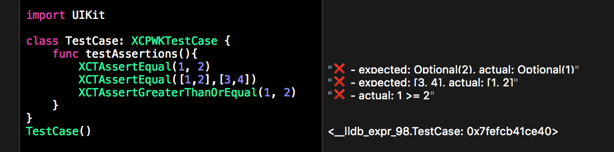

# XCTestPlayground

This repository contains a simple implementation of most `XCTAssert` macros to use in a Playground.

With the Playground feature that display the result of an executed line, it will show the assert result like this:

I use this to do TDD directly inside a Playground and then move the code as-is inside my test files.
